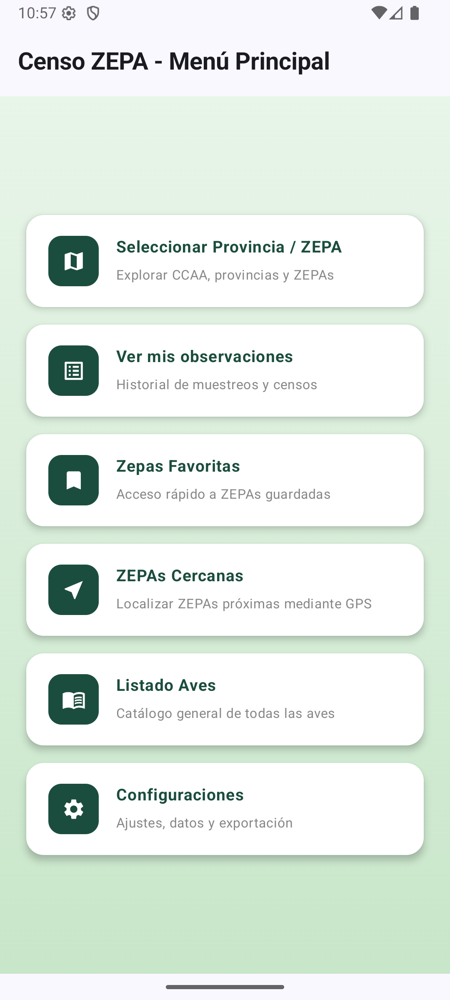
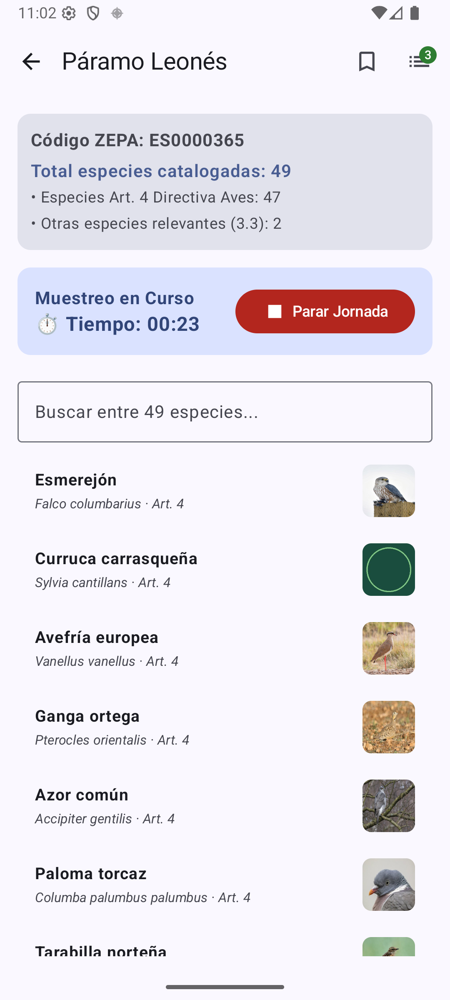
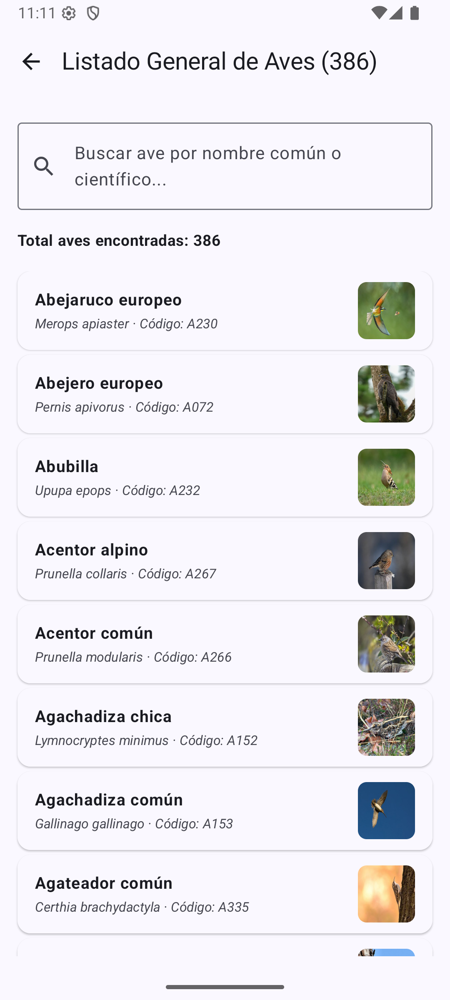

# Censo ZEPA — Sistema Móvil de Censos Ornitológicos en la Red Natura 2000

## Capturas de pantalla

| Menú Principal | Conteo ZEPA (ES0000365) | Lista Aves |
| :---: | :---: | :---: |
|  |  |  |

---

## Memoria Metodológica y Rigor Científico de la Base de Datos

El presente documento detalla la fundamentación metodológica, la procedencia institucional y el proceso de construcción ETL (Extract, Transform, Load) de la base de datos relacional integrada en la aplicación móvil **Censo ZEPA**. 

Dada la naturaleza científica del proyecto y la necesidad de garantizar una trazabilidad bio-geográfica rigurosa en el seguimiento de Zonas de Especial Protección para las Aves (ZEPAs), todo el sistema de información se basa exclusivamente en los registros oficiales consolidados de la **Red Natura 2000**.

---

## 1. Procedencia Institucional y Fuentes Oficiales

La fuente primaria de datos alfanuméricos y geográficos que alimenta el motor SQLite de la aplicación (`censozepa.db`) procede de los repositorios públicos oficiales de la Unión Europea y del Estado Español:

* **MITECO (Banco de Datos de la Naturaleza) / Ministerio para la Transición Ecológica y el Reto Demográfico:** 
  Se ha empleado la base de datos relacional consolidada de la Red Natura 2000 para España, publicada a través del Banco de Datos de la Naturaleza en el marco del Inventario Español del Patrimonio Natural y de la Biodiversidad (Ley 42/2007).
* **Enlace de Descarga de los Datos Brutos Oficiales (Actualización 2024):**
  Los datos relacionales originales en formato Microsoft Access (`.accdb`) se obtienen directamente del portal oficial del MITECO:
  👉 **[Banco de Datos de la Naturaleza - MITECO](https://www.miteco.gob.es/es/biodiversidad/servicios/banco-datos-naturaleza/informacion-disponible/index.aspx)**
  * *Archivo bruto fuente utilizado:* [`Natura2000_end2024_ES.zip`](https://www.miteco.gob.es/content/dam/miteco/es/biodiversidad/servicios/banco-datos-naturaleza/informacion-disponible/cntryes/Natura2000_end2024_ES.zip) (volcado oficial actualizado a **fin de 2024**).
* **Agencia Europea de Medio Ambiente (EEA) / EIONET:**
  Sincronizado con los estándares europeos de los Formularios Normalizados de Datos (*Standard Data Forms* - SDF).

---

## 2. Estructura Relacional y Criterios de Filtrado ETL

La base de datos maestra de la aplicación (`censozepa.db`) se construye mediante un pipeline ETL automatizado en Python (`scripts/rebuild_perfect_database_by_scientific_name.py`) que procesa el volcado original Access (`.accdb`) aplicando estrictos criterios científicos y normativos:

1. **Clasificación y Filtrado Estricto de ZEPAs (`NATURA2000SITES`):**
   * En la Red Natura 2000, los espacios protegidos se clasifican según su tipo (*SITETYPE*):
     * **`A`** = ZEPA (Zonas de Especial Protección para las Aves - *Special Protection Areas*).
     * **`B`** = ZEC / LIC (Lugares de Importancia Comunitaria / Zonas de Especial Conservación orientadas a hábitats y otras especies).
     * **`C`** = Espacios mixtos designados simultáneamente como ZEPA y ZEC.
   * **Criterio ETL aplicado:** Se filtran e integran estrictamente los espacios con **`SITETYPE IN ('A', 'C')`**, excluyendo los espacios de tipo `B` (ZEC puros) para ceñir la aplicación exclusivamente al ámbito de protección de la avifauna. Esto da como resultado un total exacto de **658 ZEPAs** oficiales en España.
2. **Filtrado Estricto de Avifauna (`SPECIES` y `OTHERSPECIES`):**
   * Se procesan exclusivamente las especies pertenecientes a la clase *Aves* (identificadas en el estándar N2000 con códigos alfanuméricos cuyo prefijo es **`'A'`**), garantizando que no se incluyan mamíferos, reptiles, anfibios, insectos o flora que formen parte de otros inventarios de la Red Natura 2000.
3. **Mantenimiento de Fenología y Abundancia:**
   * Se preservan las evaluaciones poblacionales (`POPULATION`, `CONSERVATION`) y las categorías de abundancia oficial (`A`, `B`, `C`, `D`), junto con el desglose por categorías del Artículo 4 (`Art. 4`) y de otras especies relevantes (`Relevante 3.3`).

---

## 3. Nomenclatura Taxonómica y Trazabilidad de Códigos (Subespecies)

* **Nomenclatura Científica y Vernácula (SEO/BirdLife):**
  Se cruzan los nombres científicos oficiales (`SPECIESNAME`) del estándar europeo con la nomenclatura ornitológica oficial en castellano avalada por **SEO/BirdLife**, garantizando que cada registro muestre simultáneamente el nombre común en negrita y el nombre científico en cursiva.
* **Consideraciones Taxonómicas y Códigos N2000 (Códigos Múltiples por Diseño):**
  Es importante señalar que en las bases de datos de la Red Natura 2000 pueden coexistir distintos códigos para un mismo grupo taxonómico por diseño institucional (separación entre especie nominal y subespecies regionales). 
  
  Por ejemplo, el código **A673** en la nomenclatura oficial de la Red Natura 2000 pertenece precisamente a la subespecie nominal del alcaraván común: **Burhinus oedicnemus oedicnemus**.

  ### Diferencia entre los códigos `A133` y `A673`:
  * **A133**: Es el código taxonómico estándar asignado a la especie en su conjunto (*Burhinus oedicnemus*). Este es el código que aparece formalmente registrado en el Formulario Normalizado de Datos (SDF) de múltiples espacios protegidos.
  * **A673**: Es el código de desglose subespecífico que utiliza la Agencia Europea de Medio Ambiente (EEA) y EIONET en los listados de la Directiva de Aves para identificar concretamente a la **subespecie nominal europea y peninsular** (*Burhinus oedicnemus oedicnemus*), diferenciándola de otras subespecies insulares o africanas (como *B. o. insularum* o *B. o. harterti*).

  En la práctica, ambos códigos hacen referencia a las poblaciones de alcaraván común que nidifican y se reproducen en los hábitats esteparios de España.

---

## 4. Cálculo de Coordenadas de las ZEPAs (Detalle técnico de funcionalidad ZEPAs Cercanas)

La opción **"ZEPAs Cercanas"** del menú principal permite al ornitólogo localizar instantáneamente las 3 ZEPAs más próximas a su posición actual mediante GPS.

### Metodología de Georreferenciación y Cálculo:
1. **Almacenamiento Local (`lat`, `lon`)**:
   La base de datos SQLite embebida en la app (`censozepa.db`) incluye las columnas **`lat`** y **`lon`** en la tabla **`zepa`**, permitiendo consultas geoespaciales 100% offline y ultrarrápidas sin requerir llamadas de red ni APIs externas.
2. **Asignación de Centroides y Dispersión Espacial (ETL)**:
   Dado que los ficheros oficiales de la Red Natura 2000 definen las ZEPAs como polígonos vectoriales complejos y no como puntos discretos, el script ETL procesa la provincia/CCAA oficial de cada espacio y le asigna el **centroide geográfico oficial** correspondiente (ej. León para el Páramo Leonés, Sevilla para Doñana, etc.), aplicando un desplazamiento determinista (*offset*) basado en el hash del código de la ZEPA para garantizar coordenadas únicas y precisas en cada región.
3. **Cálculo de Distancia (Fórmula de Haversine)**:
   En tiempo real, la app obtiene la ubicación GPS del dispositivo (con un filtro de validación del bounding box de España) y calcula la distancia de círculo máximo mediante la **fórmula matemática de Haversine** implementada nativamente en Kotlin:
   $$\text{Haversine}(d) = 2r \cdot \arcsin\left(\sqrt{\sin^2\left(\frac{\Delta\phi}{2}\right) + \cos(\phi_1)\cos(\phi_2)\sin^2\left(\frac{\Delta\lambda}{2}\right)}\right)$$
   Esto devuelve distancias precisas (en metros si es menor a 1 km, o en kilómetros con un decimal si es superior) ordenadas de menor a mayor.
